# 🎵 MusicManager — Gestor de Música

Aplicación web desarrollada con Django para administrar una colección
de canciones y sus artistas. Permite realizar operaciones CRUD completas
sobre ambas entidades con una interfaz moderna usando Bootstrap 5.

---

## 🛠️ Tecnologías utilizadas

- Python 3.11.9  
- Django 5.2.13
- Bootstrap 5
- SQLite 3

---

## ⚙️ Pasos para instalación y ejecución

### 1. Clona el repositorio
```bash
git clone https://github.com/eder3105/musica
cd musica
```
### 2. Crea y activa el entorno virtual
```bash
python -m venv venv
venv\Scripts\activate
```
### 3. Instala las dependencias
```bash
pip install django
```
### 4. Aplica las migraciones
```bash
python manage.py makemigrations
python manage.py migrate
```
### 5. Crea un superusuario
```bash
python manage.py createsuperuser
```
### 6. Ejecuta el servidor
```bash
python manage.py runserver
```
### 7. Abre en el navegador
```
http://127.0.0.1:8000
```
---

## 📋 Funcionalidades

- ✅ Listar, crear, editar y eliminar **Canciones** (Entidad 1)
- ✅ Listar, crear, editar y eliminar **Artistas** (Entidad 2)
- ✅ Relación entre Canción y Artista mediante ForeignKey
- ✅ Interfaz moderna con Bootstrap 5 y tema oscuro

---

## 🖼️ Capturas de pantalla

### 📸 Captura 01 — Entorno virtual activado e instalación de Django
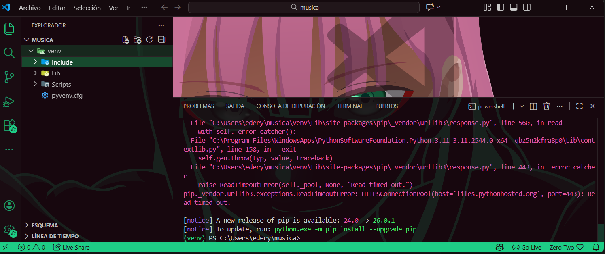

---

### 📸 Captura 02 — Estructura del proyecto en VS Code
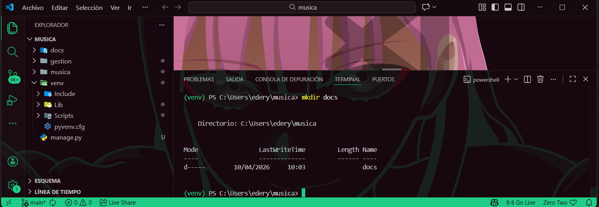

---

### 📸 Captura 03 — Migraciones aplicadas correctamente
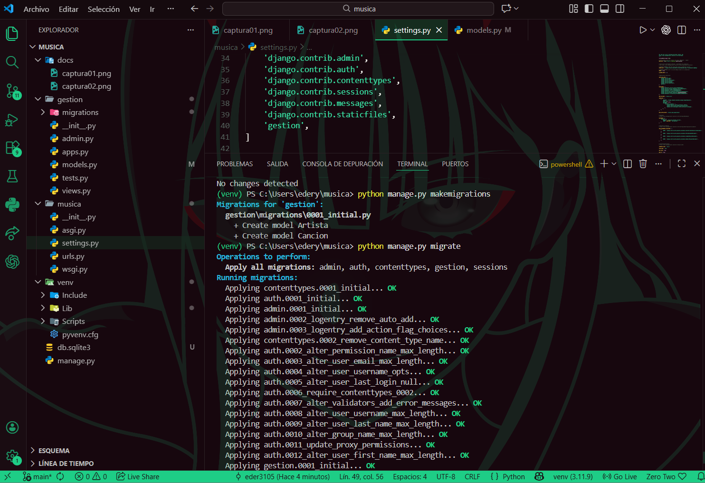

---

### 📸 Captura 04 — Panel de Administración de Django
> Vista de `http://127.0.0.1:8000/admin` con los modelos
> `Artistas` y `Canciones` registrados y disponibles.
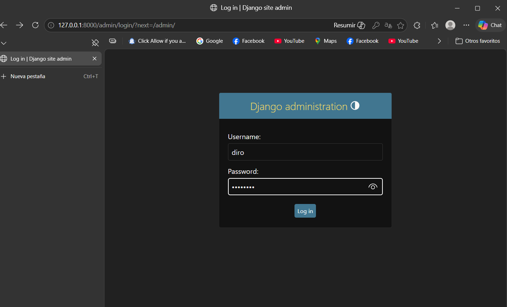

---

### 📸 Captura 05 — Listado de Artistas (sin datos)
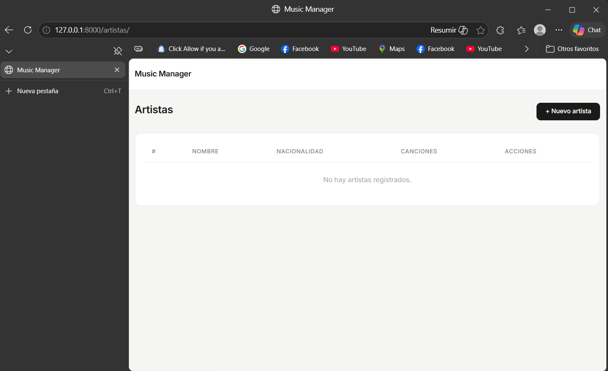

---

### 📸 Captura 06 — Formulario: Crear nuevo Artista
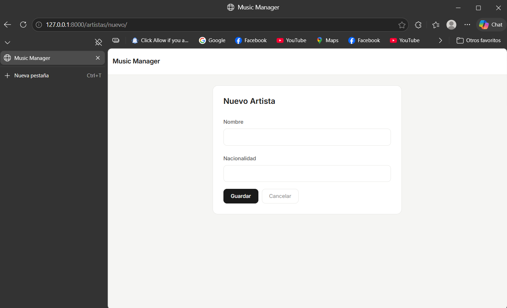

---

### 📸 Captura 07 — Listado de Artistas con datos
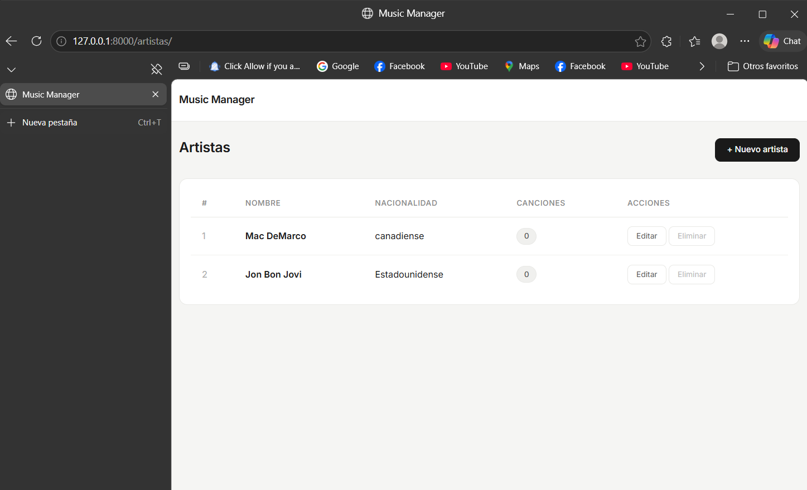

---

### 📸 Captura 08 — Listado de Canciones (sin datos)
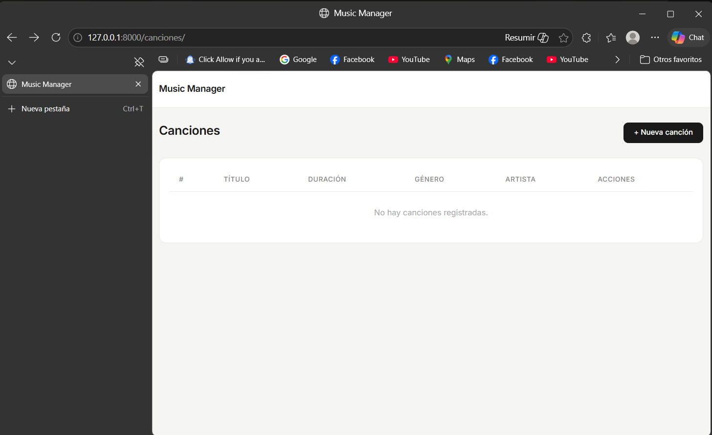

---

### 📸 Captura 09 — Formulario: Crear nueva Canción
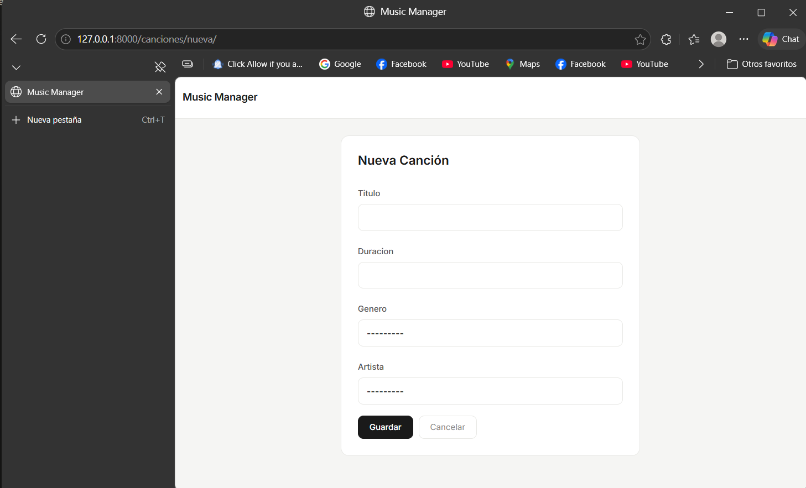

---

### 📸 Captura 10 — Listado de Canciones con datos
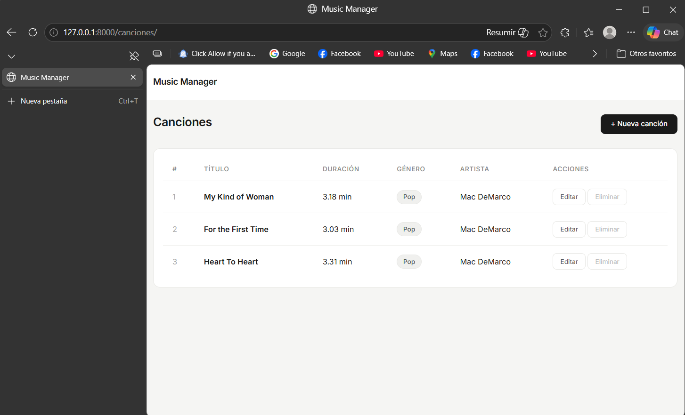

---

### 📸 Captura 11 — Editar una Canción existente
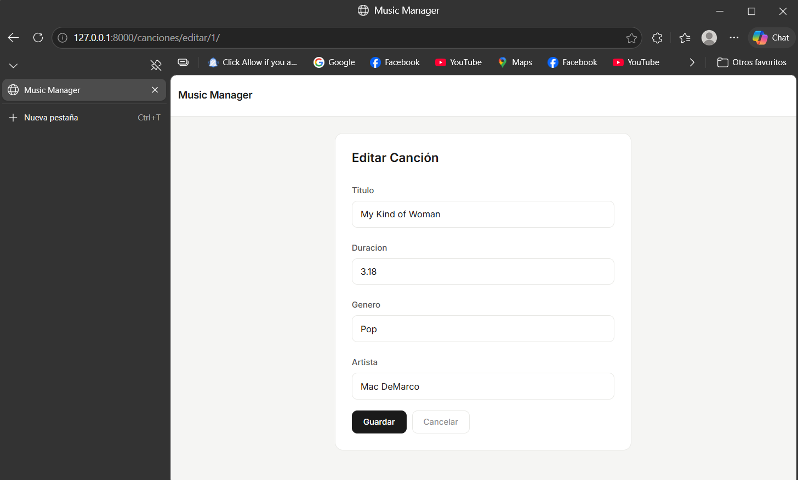

---

### 📸 Captura 12 — Confirmar eliminación de un registro
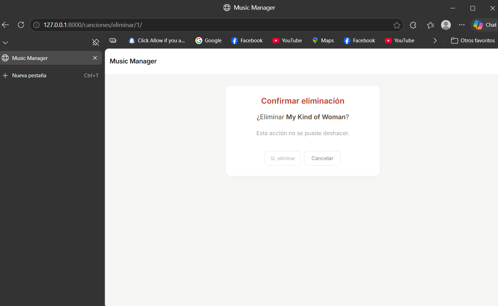

---

### 📸 Captura 13 — Base de datos en el Admin
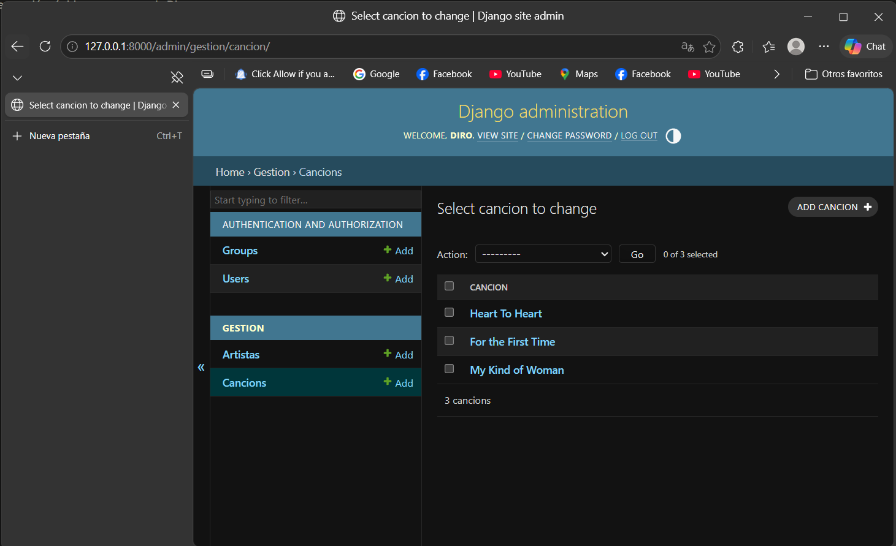

---

## 🙌 Autor

**EDERD CARRASCO OSCCO**